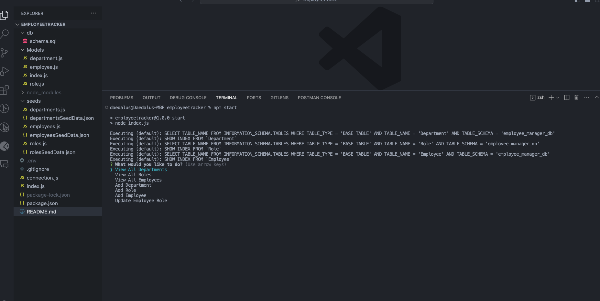
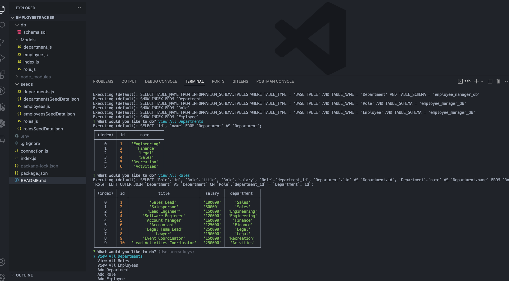

# Employee Tracker
[](https://github.com/DigitallyIntrinsic/employeetracker/issues) [](https://github.com/DigitallyIntrinsic/employeetracker/graphs/contributors) 

## Description
This application allows users to manage data tables efficiently and expediently. While this example focuses on business or company needs, it can be utilized by anyone to manage any type of datasets. The database is built with MySQL and seamlessly interacts with JavaScript through the sequelize dependency. By utilizing this approach, the need for complex and convoluted query statements is eliminated, once the initial setup for file structures and table connections is complete.
## Contents
* [Installation](#installation)
* [Usage](#usage)
   * [Screenshots](#screenshots)
* [Built With](#built-with)
* [License](#license)
* [Contributing](#contributing)
* [Questions](#questions)
* [Credits](#credits)

## Installation
To use this application, please install: 
```
To use this application, you must utilize Node.js, SQL and JavaScript. The dependencies from npm that are required are as follows: Sequelize, mysql2, dotenv, inquirer, and chalk.
```
  
## Usage
The usage of the application is fairly straightforward. Once the application is initialized, the user is presented with options and choices to make. The user has the ability to both view the data tables, as well as add/edit new entries as needed. 
  
### Screenshots





## Built With

* JavaScript
* Node.js
* Express.js
  
## License
This application is licensed under the MIT license.
  
## Contributing
There are no guidelines for contributing, please fork and use as required.
  
## Questions
If you have any questions about the repo, please [open an issue](https://github.com/DigitallyIntrinsic/employeetracker/issues) or contact me via email at gitboot@1002.us. You can find more of my work on my GitHub, [DigitallyIntrinsic](https://github.com/DigitallyIntrinsic/).
  
## Credits
* [ChatGPT](https://chat.openai.com/)

  
